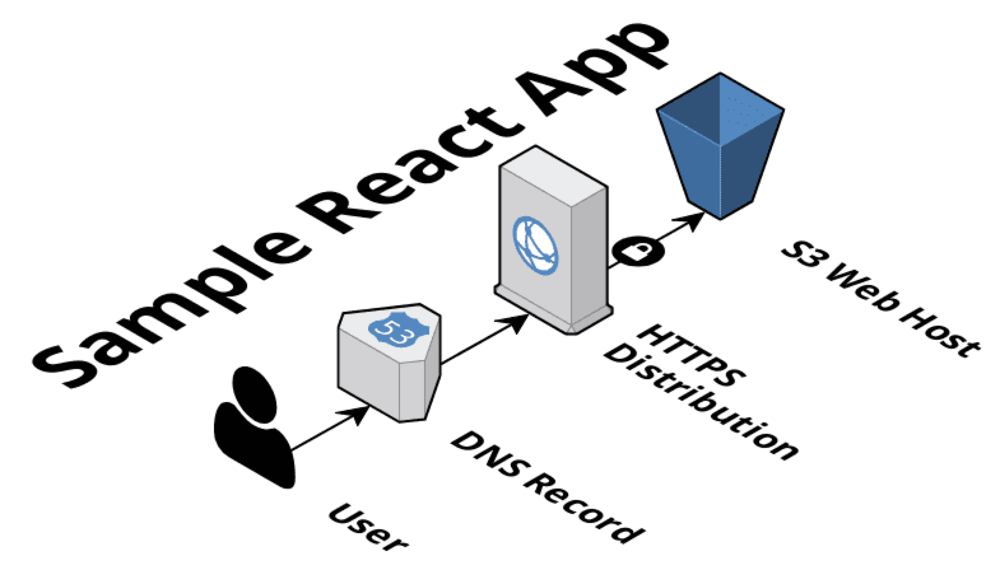

# aws-s3-wp-react
I want to consume wordpress REST api from a react front-end and deploy to S3.  
This app makes use of [the Wordpress REST API Demo](https://demo.wp-api.org/wp-json/wp/v2).

## Architecture


## Future Developments
It is my intention to deliver a serverless experience of Wordpress so,
I'll make use of AWS ECS Fargate to run the REST API Layer and the headless CMS.  
As for the data layer, I'll likely make use of Aurora Serverless MySQL.  
Amazon S3 is used to run a cutsom, minimal front-end written in React.  
Currently I had the time to just create the minimal front-end to prove
it can use Wordpress API from S3.  
In the next few weeks I'll try to build the whole stack.  

## Deployment

create a file with name `.env` with the following variables
```
AWS_DEFAULT_REGION=eu-west-1
DEPLOY_ENVIRONMENT=dev
AWS_PROFILE=myprofile
DEPLOY_BUCKET=my-deployment-bucket-${DEPLOY_ENVIRONMENT}
```
then run `./install.sh`

## Demo
deployed [here](http://gbatt-wp-s3-host-dev3.s3-website-eu-west-1.amazonaws.com/)